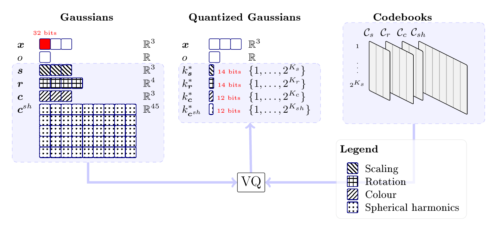

<div align="center">

  # <strong>NSVQ-GS</strong>: Compressing 3D Gaussian Splatting by Noise-Substituted Vector Quantization

  <p align="center">
    <a href="https://haishan-wang.github.io">Haishan Wang</a> ·
    <a href="https://research.aalto.fi/en/persons/mohammad-hassan-vali">Mohammad Vali</a> .
    <a href="https://users.aalto.fi/~asolin/">Arno Solin</a>
  </p>

  <h2 align="center">SCIA 2025</h2>

  <h3>
    <a href="https://arxiv.org/abs/2504.03059">Paper</a> 
  </h3>

</div>

---

This is the public codes for SCIA2025 paper: "Compressing 3D Gaussian Splatting by Noise-Substituted Vector Quantization"

<div align="center">
  
  <p> Overview of Storage structure of NSVQ-GS </p>
</div>

## Repo clone
The command to clone our repo: `git clone git@github.com:AaltoML/nsvqgs.git --recursive`.
Since the repo contains submodules, please clone it recursively, and make sure the dir `submodules` contains non-empty subdirs

## Environment installation
The python environment is installed by 
`conda env create -f environment.yml` with the environment name `nsvqgs`

### Notes of env 
This note contains additional information about the environment installation, you can skip it if you have installed it successfully already.

This env is very similar to [the environment of Inria-GaussianSplatting repo](https://github.com/graphdeco-inria/gaussian-splatting/blob/main/environment.yml). The solutions to some installation issues maybe exist in this repo.

We succeed to install the environment by the `environment.yml` with `cuda=11.6.2, and gcc=9.2.0`. However, this environment is very sensitive to the versions of CUDA, torch and gcc. And there are possibly bugs during the installaion of submodules. If the `environment.yml` built by conda fails inside the submodules with cuda version incompatiblility. We recommend to install all packages without submodules, then install cuda tool one by one:
`mamba install -c "nvidia/label/cuda-11.6.0" cuda-toolkit`
`mamba install -c "nvidia/label/cuda-11.6.0" cuda-nvcc`
Then make sure the cuda compiler is 11.6 by
`nvcc -V`
Then install all submodules by pip.
```
pip install submodules/diff-gaussian-rasterization
pip install submodules/simple-knn
pip install submodules/fused-ssim
```
## Data download 
Running `python scripts/data_download.py`, the script will download the main three datasets: Mip-NeRF360 (9 scenes), Tanks & Temples (2 scenes) and Deep Blending (2 scenes).
Note that the data source: Mip-NeRF360 is from [Mip-NeRF 360](https://jonbarron.info/mipnerf360/), Tanks & Temples (2 scenes) and Deep Blending are from [Inria-3DGS](https://repo-sam.inria.fr/fungraph/3d-gaussian-splatting/).

### Default settings
There are some default settings following Inria-3DGS:
- Data split: Every 8th image must be selected for testing, specifically those images of index i where i mod 8 ≡ 0. All other images are used for training.
- Resolution: Full-resolution images should be used up to a maximum side length of 1600px. For larger test images, downscaling is required so that the longest dimension is 1600px.

## Training 


## Evaluation

